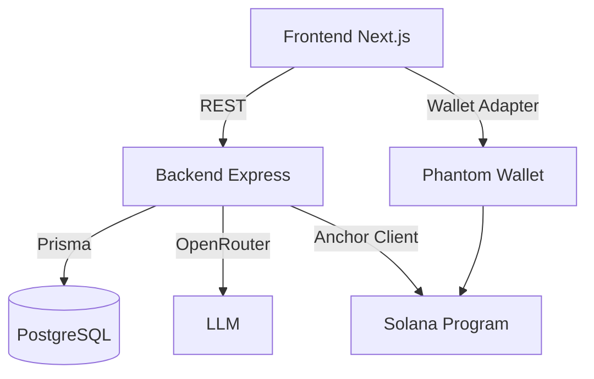
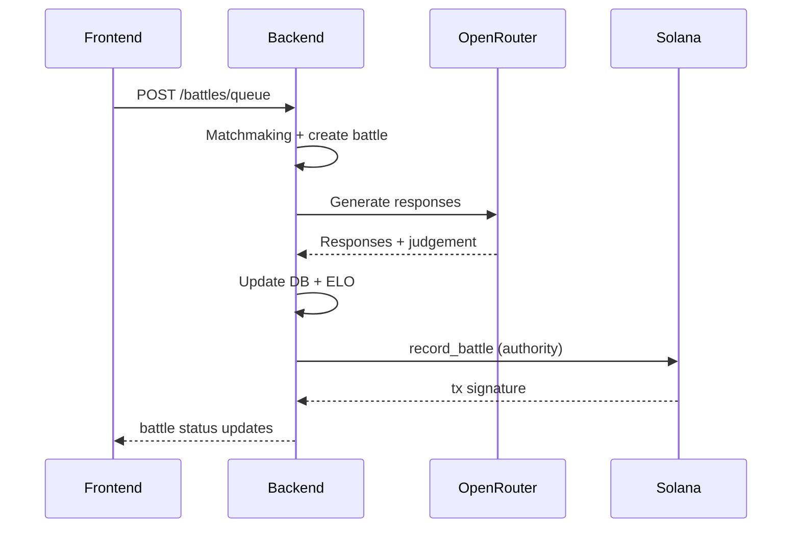

# Agent Arena - Full System Audit Report

Date: 2026-05-10

# 1. Executive Summary

**Overall architecture quality**
- Solid feature coverage for a hackathon MVP, but integration boundaries are weak and several critical flows are stubbed or inconsistent.
- Backend services are cleanly separated, yet multiple core systems are in-memory and not safe for multi-instance or restarts.
- Solana + Anchor integration is partially implemented; on-chain writes are currently non-functional.

**Biggest system risks**
- On-chain recording is a stub and uses wrong wallet addresses, so Solana proofs are not actually happening.
- Authentication and wallet session state can easily desync (wallet disconnects, multi-tab, or refresh).
- Matchmaking, auth nonces, and rate limits are in-memory and will break under scaling or restart.
- Frontend battle flow uses polling and UI phases that can drift from actual backend state.

**Critical blockers**
- Battle on-chain recording cannot succeed as implemented (missing anchor client and wrong wallet address usage).
- Arena page agent loading is broken due to use of `useState` for side effects.
- Anchor program flows are not wired (no register agent, no record battle txs).

**Demo-breaking issues**
- Solana explorer link is a placeholder, so "on-chain proof" demo fails.
- Phantom sign-in failures can occur without clear recovery flow.
- Battle queue state disappears on backend restart, leaving clients stuck.

**Scalability concerns**
- In-memory queue, nonce store, and AI rate limits do not scale or survive process restarts.
- Lack of background jobs and idempotency for battle execution risks duplicated or dropped battles.

# 2. Full Project Structure Analysis

**Structure and modularity**
- Backend is structured with controllers, services, middleware, and config; clean separation.
- Frontend follows App Router and component separation.
- Contracts live under `contracts/` with Anchor standard layout.

**Consistency and technical debt**
- Several "graceful degradation" paths are actually silent failures, masking integration problems.
- Type mirroring between frontend and backend is partial but not enforced (no shared package).
- Some front-end pages contain logic errors and missing lifecycle guards.

**Folder structure example**

```
agent-arena/
  backend/
    src/
      controllers/
      services/
      middleware/
      routes/
  frontend/
    app/
    components/
    context/
  contracts/
    programs/
      contracts/
        src/
```

# 3. Frontend Audit

## Key issues and fixes

1) **Agents not loading on Arena page**
- Cause: Side effect is in `useState` instead of `useEffect`, so data fetch never runs reliably.
- Location: [frontend/app/arena/page.tsx](frontend/app/arena/page.tsx)
- Fix: Replace the `useState(() => { ... })` block with a `useEffect`.

2) **Wallet auth session desync**
- Cause: `AuthContext` does not react to wallet disconnects or wallet changes.
- Location: [frontend/context/AuthContext.tsx](frontend/context/AuthContext.tsx)
- Impact: User appears logged in even if wallet disconnects or changes.
- Fix: Add a `useEffect` to clear session when `publicKey` changes or `connected` becomes false.

3) **Battle UI phase drift**
- Cause: UI uses a timer-based "dramatic sequence" that can run even if data is missing or stale.
- Location: [frontend/app/battle/[id]/page.tsx](frontend/app/battle/[id]/page.tsx)
- Fix: Drive phases from actual battle state and presence of `agent1Response`/`agent2Response`.

4) **SSE not used but partially implemented**
- Cause: Frontend includes SSE client but battle page uses polling, causing duplicate live update patterns.
- Location: [frontend/lib/api.ts](frontend/lib/api.ts)
- Fix: Adopt SSE for live updates or remove SSE to avoid confusion and double maintenance.

5) **Static Solana explorer link**
- Cause: Link uses a placeholder tx URL with no signature.
- Location: [frontend/app/battle/[id]/page.tsx](frontend/app/battle/[id]/page.tsx)
- Fix: Return actual tx signature or battle account from backend and link to it.

6) **API error handling assumes JSON**
- Cause: `api.request` parses JSON even on non-JSON responses (e.g., HTML errors).
- Location: [frontend/lib/api.ts](frontend/lib/api.ts)
- Fix: Guard response parsing, handle `Content-Type` or use `res.text()` fallback.

## Additional improvements
- Add a global error boundary and per-route error UI for network or blockchain failures.
- Use `WalletAdapterNetwork.Devnet` + consistent RPC config for wallet and backend.
- Add a low-friction re-login banner when the backend token is invalid.

## Example fix: auth sync on wallet disconnect

```ts
useEffect(() => {
  if (!connected || !publicKey) {
    api.setToken(null);
    setUser(null);
  }
}, [connected, publicKey]);
```

# 4. Backend Audit

## Key issues and risks

1) **In-memory nonce store**
- Risk: Breaks with multi-instance deployment and loses state on restart.
- Location: [backend/src/services/auth.service.ts](backend/src/services/auth.service.ts)
- Fix: Store challenges in Redis or DB with TTL and nonce reuse protection.

2) **In-memory matchmaking queue**
- Risk: Lost on restart; inconsistent across multiple servers.
- Location: [backend/src/services/battle.service.ts](backend/src/services/battle.service.ts)
- Fix: Persist queue in DB or Redis; add an explicit "leave queue" endpoint.

3) **Session handling not invalidated**
- Risk: Tokens remain valid until expiry; logout only clears client state.
- Location: [backend/src/middleware/auth.ts](backend/src/middleware/auth.ts)
- Fix: Add `POST /api/auth/logout` to delete session, and optional rotation.

4) **Input validation gaps**
- Risk: Missing schema validation for most endpoints.
- Location: [backend/src/controllers](backend/src/controllers)
- Fix: Add zod validation per route and enforce agent name length to match on-chain limits.

5) **Error handling not granular for upstream AI calls**
- Risk: AI service failures are surfaced as generic 500, reducing debuggability.
- Location: [backend/src/services/ai/openrouter.service.ts](backend/src/services/ai/openrouter.service.ts)
- Fix: Include request IDs, model name, and openrouter status in logs.

## Example fix: explicit schema validation

```ts
const schema = z.object({
  agentId: z.string().cuid(),
  category: z.enum(["knowledge", "strategy", "productivity", "prediction", "social"]),
});
const { agentId, category } = schema.parse(req.body);
```

# 5. Solana + Anchor Audit (Critical)

## Current state
- The Anchor program is fully defined, but the backend does not invoke it.
- The backend Solana service returns a placeholder tx signature and does not send a transaction.
- Agent registration on-chain is not wired from frontend or backend.

## Critical problems

1) **On-chain recording is stubbed**
- Location: [backend/src/services/solana.service.ts](backend/src/services/solana.service.ts)
- Impact: No battle data is ever written on-chain.
- Fix: Implement Anchor client, load IDL, and send a real `record_battle` instruction.

2) **Wrong wallet address used for on-chain PDAs**
- Cause: `agent1Wallet` and `agent2Wallet` are set to `userId` instead of wallet address.
- Location: [backend/src/services/battle.service.ts](backend/src/services/battle.service.ts)
- Impact: PDA derivations are invalid; any transaction would fail.

3) **Arena account read uses hard-coded offsets**
- Location: [backend/src/services/solana.service.ts](backend/src/services/solana.service.ts)
- Impact: Breaks if struct changes or padding differs.
- Fix: Use Anchor account decode with IDL for robust parsing.

4) **Authority keypair loading can crash health check**
- Cause: default `[]` is invalid and `getAuthority()` is called even in health checks.
- Location: [backend/src/services/solana.service.ts](backend/src/services/solana.service.ts)
- Fix: Guard against missing keypair and return a degraded health status.

## Recommended architecture
- Frontend handles `register_agent` with user wallet signature.
- Backend signs `record_battle` via authority keypair (server-side).
- Store the agent PDA in the DB for future lookups.

## Example Anchor client wiring (backend)

```ts
const provider = new anchor.AnchorProvider(
  new anchor.web3.Connection(env.SOLANA_RPC_URL, "confirmed"),
  new anchor.Wallet(authorityKeypair),
  { commitment: "confirmed" }
);
const program = new anchor.Program(idl as anchor.Idl, PROGRAM_ID, provider);

await program.methods
  .recordBattle(resultCode, categoryCode, score1, score2, resultHash)
  .accounts({
    arena: arenaPDA,
    battle: battlePDA,
    agent1: agent1PDA,
    agent2: agent2PDA,
    authority: authorityKeypair.publicKey,
    systemProgram: anchor.web3.SystemProgram.programId,
  })
  .signers([authorityKeypair])
  .rpc();
```

## Debugging steps
- `solana config get`
- `solana logs -u devnet | grep contracts`
- `anchor test`
- `solana address`
- `solana account <arenaPDA> -u devnet`

# 6. OpenRouter + AI Audit

## Findings
- `callLLMWithTier` uses only the first model and ignores the tier fallback list.
- No timeout or abort handling, so calls can hang.
- JSON retry parsing does not re-strip markdown fences on the second attempt.
- Memory compaction can block requests and is not idempotent.

## Fixes
- Use the full tier model list on fallback.
- Add request timeout with `AbortController`.
- Add queue-based memory compaction.
- Store raw prompts and AI outputs for post-mortem debugging.

## Example: tier fallback fix

```ts
export async function callLLMWithTier(tier: ModelTier, options: Omit<LLMCallOptions, "model">) {
  const models = MODEL_TIERS[tier];
  return callLLM({ ...options, model: models[0], fallbackModels: models });
}
```

# 7. Database Audit

## Schema issues
- No index on `Battle.agent1Id` and `Battle.agent2Id`, but frequent queries use them.
- No retention or cleanup for sessions or chat history.
- No unique constraint enforcing per-user agent name, which can cause UI confusion.

## Recommendations
- Add indexes to `Battle` for `agent1Id` and `agent2Id`.
- Add cleanup job for expired sessions and old chat messages.
- Consider a `unique` compound index on `(userId, name)`.

# 8. Authentication Audit

## Findings
- In-memory nonce storage breaks in multi-instance deployments.
- No explicit logout endpoint to revoke sessions.
- No protection against signature replay across server instances.
- Token stored in `localStorage` without refresh or rotation.

## Fixes
- Store nonce + issuedAt + expiresAt in DB or Redis.
- Implement `POST /api/auth/logout` to delete session.
- Use SIWS-style message format with domain + wallet + chain + nonce.

# 9. Integration Flow Audit

Flow: Wallet Connect → Sign Message → Authenticate → Create Agent → Store in DB → Anchor transaction → AI battle → XP update → Leaderboard refresh

**Breaking points**
- Wallet connect succeeds, but sign-in fails silently if `signMessage` unsupported.
- Agent creation in DB does not register on-chain.
- Anchor transaction never runs, so on-chain proof is missing.
- Battle queue is in-memory; restarts drop state.
- XP updates and battle completion depend on AI calls without retries or idempotency.

**Race conditions**
- Battle status updates can race with UI polling and typewriter UI states.
- Memory compaction can overlap with chat responses.

# 10. Error Handling Audit

**Frontend**
- No error boundaries, no centralized toast or fallback UI.
- API errors surface as generic exceptions and alerts.

**Backend**
- Error handler is solid for Prisma errors, but misses upstream AI and Solana errors.
- `recordBattleOnChain` swallows failures without returning metadata to the client.

**Recommended architecture**
- Centralize error responses with a consistent error code structure.
- Provide a `traceId` for each request and pass into AI and Solana logs.
- Implement retry strategy for AI and Solana with exponential backoff.

# 11. Performance Audit

**Frontend**
- Excessive polling in battle page (every 2s). Replace with SSE or websocket.
- Typewriter animations can be heavy for long responses.

**Backend**
- AI calls are synchronous and block request lifecycle. Use job queue or worker.
- No caching layer for leaderboard or agent summaries.

**Suggestions**
- Cache leaderboard for 15-30 seconds.
- Use SSE for battle updates.
- Add batching for chat history queries.

# 12. Deployment Audit

**Environment variables**
- Backend requires `OPENROUTER_API_KEY` and `JWT_SECRET` at startup; missing values will crash.
- Solana keypair default `[]` is invalid and causes runtime crashes.

**Vercel / production readiness**
- Make `NEXT_PUBLIC_API_URL` and `NEXT_PUBLIC_SOLANA_RPC` mandatory in prod.
- Ensure CORS supports preview URLs or multi-origin.
- Ensure backend environment includes a valid authority keypair and program ID.

# 13. Debugging Strategy

1) Verify backend health: `curl http://localhost:3001/health`
2) Validate auth flow: challenge → sign → verify
3) Validate DB writes: `npx prisma studio`
4) Validate battle queue and battle creation
5) Add temporary logging for Solana tx assembly
6) Enable AI logging per request
7) Validate SSE or websocket streaming

# 14. Priority Fix Roadmap

**CRITICAL**
- Implement real Anchor `record_battle` + `register_agent` integration.
- Fix Arena page agent loading bug.
- Fix wallet address mapping for PDAs.
- Provide real on-chain explorer link with tx signature.

**HIGH**
- Fix auth session desync and add logout endpoint.
- Replace in-memory queue and nonce store with Redis.
- Add API validation with zod.

**MEDIUM**
- Add SSE battle updates and remove polling.
- Improve error handling and add error boundaries.
- Add caching for leaderboard.

**LOW**
- Add background compaction jobs for memory.
- Add more structured AI logging and analytics.

# 15. Final Architecture Recommendations

- Use a clear separation:
  - Frontend: wallet connect + agent creation + battle UI
  - Backend: AI orchestration + DB + Solana authority transactions
  - Chain: minimal immutable proof of battle results
- Make on-chain writes idempotent via deterministic battle PDA.
- Add a lightweight job queue for battles and AI requests.
- Stabilize the auth flow and store sessions in a dedicated auth table with rotation.

# Architecture Diagrams

## System Overview



## Battle Execution Flow



# Appendix: Key File References

- [backend/src/services/battle.service.ts](backend/src/services/battle.service.ts)
- [backend/src/services/solana.service.ts](backend/src/services/solana.service.ts)
- [backend/src/services/auth.service.ts](backend/src/services/auth.service.ts)
- [backend/src/utils/solana.ts](backend/src/utils/solana.ts)
- [backend/src/services/ai/openrouter.service.ts](backend/src/services/ai/openrouter.service.ts)
- [frontend/context/AuthContext.tsx](frontend/context/AuthContext.tsx)
- [frontend/app/arena/page.tsx](frontend/app/arena/page.tsx)
- [frontend/app/battle/[id]/page.tsx](frontend/app/battle/[id]/page.tsx)
- [contracts/programs/contracts/src/instructions/record_battle.rs](contracts/programs/contracts/src/instructions/record_battle.rs)
- [contracts/programs/contracts/src/instructions/register_agent.rs](contracts/programs/contracts/src/instructions/register_agent.rs)
